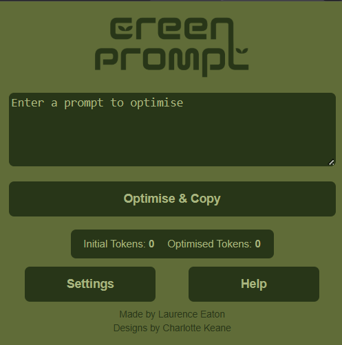

[Install from Chrome Web Store](https://chromewebstore.google.com/detail/greenprompt/ojkbbbkllijlcdbjijcgcphebnjdonji)

GreenPrompt is a **free chrome extension** that rewrites your AI prompts to be shorter and more efficient. 

By minimising unnecessary processing, it reduces wasted energy and helps make your daily AI use more sustainable.
We use a highly efficient and low cost AI model (Qwen2.5-3B-Instruct) through Huggingface to refine your prompt before it reaches a more powerful model used for reasoning such as GPT-5.

This initial step removes unnecessary information whilst preserving your prompt's functional meaning. This means the larger, more energy-intensive model has less data to analyse, leading to a significant overall reduction in processing and energy use.

Simply paste in your prompt, press optimise, and your new efficient prompt will be copied to your clipboard and ready to use!

### Demo

### Extension page

